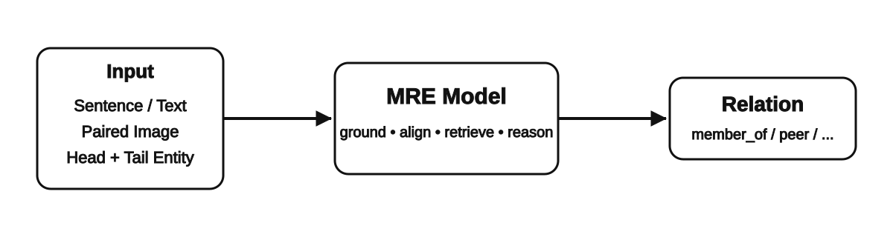
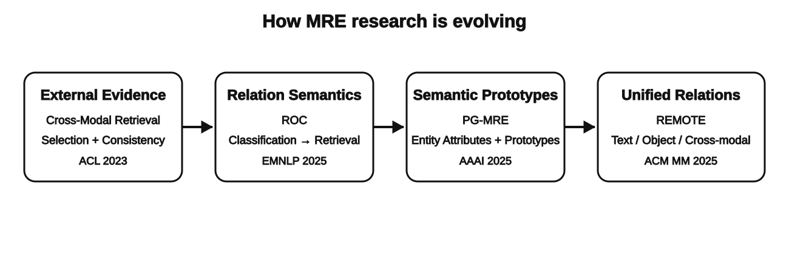
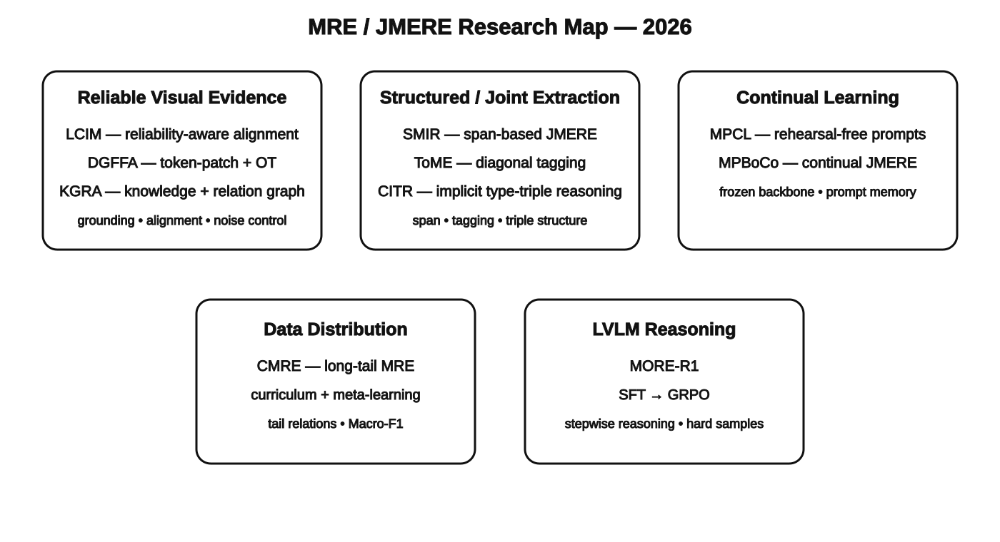
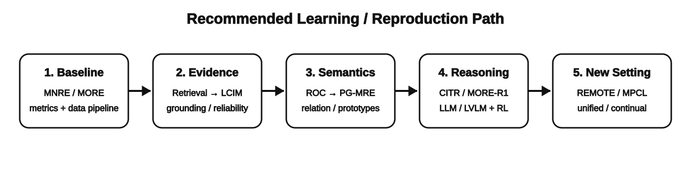

# MRE-learning

> Multimodal Relation Extraction（多模态关系抽取，MRE）学习笔记。  
> 组织方式参考 `VLA-Attack-learning`：**先把任务讲明白，再按论文逐篇拆方法、动机、优缺点与复现价值**。

<p align="center">
  
</p>

## 一句话理解 MRE

**给模型一段文本、一张关联图片，以及目标实体对，让模型判断两个实体之间是什么关系。**

标准 MRE 可以写成：

\[
(T, I, e_h, e_t) \rightarrow r
\]

- `T`：text / sentence，文本上下文  
- `I`：paired image，配对图像  
- `e_h, e_t`：head / tail entity，头实体与尾实体  
- `r`：relation，关系类别或关系语义  

真正难点并不是“把图像 embedding 和文本 embedding 拼起来”，而是：

1. **视觉证据在哪里？**（visual grounding / evidence localization）
2. **图像到底值不值得信？**（visual reliability / modality noise）
3. **关系应该被当成离散 label，还是有语义的对象？**（relation semantics）
4. **实体、关系、图像对象应该分开抽还是一起抽？**（MRE / JMERE / UMRE）
5. **新关系不断出现时怎么避免遗忘？**（continual MRE）
6. **能不能让 LVLM/MLLM 显式推理，而不只是做分类？**（reasoning-oriented MRE）

<p align="center">
  
</p>

---

## 先区分几个容易混淆的任务

| 缩写 | 全称 | 核心输出 | 你可以怎么理解 |
|---|---|---|---|
| **MRE / MNRE** | Multimodal Relation Extraction | 文本实体对之间的关系 | 图片作为关系判断的辅助证据 |
| **MORE** | Multimodal Object-Entity Relation Extraction | 文本实体 ↔ 图像对象的关系 | 关系跨越 text / image 两个模态 |
| **JMERE** | Joint Multimodal Entity-Relation Extraction | 实体 + 关系联合抽取 | 不再假设实体已经给定 |
| **UMRE** | Unified Multimodal Relation Extraction | text-text / image-image / text-image 多种关系 | 把不同 triplet 类型统一起来 |
| **MCRE** | Multimodal Continual Relation Extraction | 持续学习新关系 | 重点是 catastrophic forgetting |
| **CMERJE** | Continual Multimodal Entity and Relation Joint Extraction | 持续学习实体与关系 | continual + joint extraction |

---

## 常用数据集 / 代码入口

- **MNRE**：经典 MRE 基准。Repository: https://github.com/thecharm/MNRE
- **MORE**：面向 object-entity cross-modal relation。Repository: https://github.com/NJUNLP/MORE
- **UMRE**：REMOTE 提出的 unified MRE 数据设置与资源。Repository: https://github.com/Nikol-coder/REMOTE
- **CMERJE**：MPBoCo 对 continual joint extraction 构建的新设置，官方仓库附 Hugging Face 数据集入口。

## 常见评测指标

标准关系抽取主要看：

- **Accuracy**
- **Precision / Recall**
- **Macro-F1 / Micro-F1 / Weighted-F1**
- 对长尾任务尤其关注 **Macro-F1**
- 对 grounding / reliability 工作，需要额外看 **grounding accuracy、alignment quality、robustness under noisy images**
- 对 continual learning，还要看 **average performance、forgetting、plasticity/stability trade-off**

---

# Part I. 之前上传的 4 篇核心论文

这 4 篇建议按下面顺序读，因为它们刚好对应 MRE 研究思路的四次推进：

> **外部证据 → 关系语义 → 实体/关系原型 → 统一多模态关系空间**

---

## 论文 1：Multimodal Relation Extraction with Cross-Modal Retrieval and Synthesis

**ACL 2023 Short | Hu et al.**

- Paper note: [`Papers/core/01_Cross_Modal_Retrieval_and_Synthesis.md`](./Papers/core/01_Cross_Modal_Retrieval_and_Synthesis.md)
- 论文给出的代码入口：`https://github.com/THU-BPM/MRE`  
  > 该链接来自论文正文；如果当前 GitHub 页面失效，以作者最新公开页面为准。

### 它到底做了什么？

早期 MRE 大多只看原始 sentence-image pair。这篇论文的关键改变是：

> **原始输入不够，就去检索额外的 visual evidence 和 textual evidence。**

它不是只做 text retrieval，而是同时：

- 从 image / object 出发找 textual evidence；
- 从 sentence 出发找 visual evidence；
- 再通过 **Cross-Modal Selection** 和 **Cross-Modal Consistency** 控制噪声；
- 最后把原始内容 + 检索证据一起用于关系分类。

### 最值得学的点

**Retrieval 本身不是核心，evidence selection 才是。**

外部证据越多并不一定越好；错误、无关的 evidence 会直接污染 relation prediction。这个思想后来会自然发展成：

- reliability-aware MRE
- evidence grounding
- retrieval-augmented MRE
- source-aware / relation-aware evidence selection

---

## 论文 2：Retrieval over Classification: Integrating Relation Semantics for Multimodal Relation Extraction

**EMNLP 2025 | ROC**

- Official paper: https://aclanthology.org/2025.emnlp-main.943/
- Paper note: [`Papers/core/02_ROC_Retrieval_over_Classification.md`](./Papers/core/02_ROC_Retrieval_over_Classification.md)
- Official source code：**截至 2026-09-16 未找到公开官方实现**

### 传统方法的问题

传统分类范式：

\[
h_{pair} \rightarrow \text{Linear} \rightarrow \text{relation id}
\]

问题是 relation 被压成一个离散 ID：

```text
0 = peer
1 = couple
2 = member_of
...
```

模型实际上没有显式理解 `"peer"` 和 `"couple"` 在语义上哪里不同。

### ROC 的核心

ROC 把任务改成：

\[
\text{entity-pair representation}
\leftrightarrow
\text{relation description}
\]

关系不再只是一维 label，而是先由自然语言描述，再编码成 **relation semantic embedding**。

训练时用 contrastive learning，让正确的 entity-pair / relation-description 更近，错误关系更远。

### 为什么这篇对后续研究很重要？

它把 MRE 从：

> **feature → classifier**

改成了：

> **feature → semantic retrieval**

这为下面这些方向打开空间：

- 多描述 relation representation
- relation prototype
- hard-negative relation retrieval
- open-world / zero-shot relation matching
- LLM-generated relation semantics

---

## 论文 3：Prototype-Guided Multimodal Relation Extraction based on Entity Attributes

**AAAI 2025 | PG-MRE**

- Official paper: https://doi.org/10.1609/aaai.v39i24.34795
- Official repository: https://github.com/zefanZhang-cn/PG-MRE
- Paper note: [`Papers/core/03_PG_MRE.md`](./Papers/core/03_PG_MRE.md)

> 注意：官方 GitHub 仓库目前仍写着 **code will be available soon**，不能把它当成完整可复现源码。

### 它解决什么问题？

MRE 中经常遇到：

- entity name 很生僻 / unseen；
- text 本身表达不清楚；
- 同一个 relation 的图像外观变化极大；
- 不同 relation 的视觉模式又可能很像。

PG-MRE 的做法是先让 LLM 给实体补充 **entity explanation / attributes**，然后构建：

- **Attribute Prototype Module (APM)**
- **Relation Prototype Module (RPM)**

把散乱的 entity semantics 与 multimodal relation features 聚成 prototype。

### 最值得学的点

LLM 不一定要直接当 predictor。

它可以作为：

> **semantic knowledge provider**

也就是用 LLM 提供稳定的 entity attributes / explanations，然后交给较小的判别模型处理。

---

## 论文 4：REMOTE: A Unified Multimodal Relation Extraction Framework with Multilevel Optimal Transport and Mixture-of-Experts

**ACM MM 2025 | REMOTE**

- Paper: https://doi.org/10.1145/3746027.3754868
- Code: https://github.com/Nikol-coder/REMOTE
- Paper note: [`Papers/core/04_REMOTE.md`](./Papers/core/04_REMOTE.md)

### 它改变了什么？

之前很多工作只做一种 triplet：

- text entity ↔ text entity
- 或 text entity ↔ visual object

REMOTE 认为现实世界不应该被这个设定限制，于是提出 **Unified MRE**：

\[
R =
\{(e,e,r), (o,o,r), (e,o,r)\}
\]

同时覆盖：

- text-text
- object-object
- text-object

### 方法

两个关键词：

1. **Mixture-of-Experts (MoE)**  
   不同 triplet 类型动态选择更合适的 modality interaction。
2. **Multilevel Optimal Transport**  
   保留低层视觉/文本信息，同时进行高层语义融合。

### 为什么值得读？

它不是只改一个 fusion block，而是改了 **task formulation**。

当一个方向已经大量堆模块时，“重新定义任务边界”往往比继续微调 fusion 更有研究价值。

---

# Part II. 最近 10 个月：10 篇值得跟的论文

筛选截止：**2026-09-16**。  
为了严格落在“最近约 10 个月”的范围内，这里优先选择 **2026 年发表/上线**、且和 MRE / JMERE / MORE / continual MRE 直接相关的工作。

<p align="center">
  
</p>

| # | 时间 | Paper | 方向 | 源码 |
|---:|---|---|---|---|
| 1 | 2026-09 | **LCIM: Modeling Latent Cross-Modal Interaction for Reliability-Aware Entity Alignment in MRE** | reliability / entity grounding | ✅ https://github.com/liuxiyang641/LCIM |
| 2 | 2026-07 | **MPBoCo** | continual JMERE / prompt learning | ✅ https://github.com/xinyuucn/MPBoCo |
| 3 | 2026-07 | **SMIR** | span-based JMERE / multi-grained refinement | — 暂未找到官方源码 |
| 4 | 2026-07 | **ToME: A Diagonal-Tagging-Based Cross-Modal Extraction Strategy** | unified tagging / multimodal KG | — 暂未找到官方源码 |
| 5 | 2026-06 | **CMRE: Curriculum-Meta Learning for Unbiased MRE** | long-tail / curriculum / meta-learning | — 暂未找到官方源码 |
| 6 | 2026-05 | **MPCL** | continual MRE / rehearsal-free prompts | — 暂未找到官方源码 |
| 7 | 2026-04 | **DGFFA** | fine-grained alignment / graph fusion / OT | — 暂未找到官方源码 |
| 8 | 2026-04 | **KGRA** | relation-aware graph / external knowledge | ⚠️ 论文给出 `djtuNLP/KGRA`，当前公开入口需再次确认 |
| 9 | 2026-03 | **CITR** | LMM context / implicit triple reasoning / JMERE | — 暂未找到官方源码 |
| 10 | 2026-03 | **MORE-R1** | LVLM reasoning / SFT + GRPO / MORE | ✅ https://github.com/MartinYuanNJU/MORE-R1 |

对应的逐篇学习笔记放在 [`Papers/recent-2026/`](./Papers/recent-2026/)。

---

## 近期论文 1：LCIM

**Modeling Latent Cross-Modal Interaction for Reliability-Aware Entity Alignment in Multimodal Relation Extraction**  
Knowledge-Based Systems, 2026. DOI: https://doi.org/10.1016/j.knosys.2026.116474

### 一句话

> **不要默认 MLLM 给出的 entity grounding 是正确的；先量化 grounding 的可靠性，再拿它指导 MRE。**

LCIM 很值得关注，因为它把 MLLM 当成 **noisy annotator**，而不是 oracle。

它利用 region-level MLLMs 产生 entity alignment annotation，同时估计 reliability score，再把这些 annotation 用于 MRE 模型训练。

**这篇特别适合研究 visual evidence reliability / entity grounding 的人。**

---

## 近期论文 2：MPBoCo

**ACL 2026**  
Paper: https://aclanthology.org/2026.acl-long.1220/  
Code: https://github.com/xinyuucn/MPBoCo

### 一句话

> **不用 replay 旧样本，用 multimodal prompts 把每个阶段的新知识存进 frozen backbone。**

MPBoCo 提出 **Continual Multimodal Entity and Relation Joint Extraction (CMERJE)**：

- learnable multimodal prompt
- type-aware prompt matching
- frozen backbone
- boundary-enhanced dual branch

这是很典型的 2026 趋势：从固定 benchmark 上的单次训练，转向 **continual / evolving relation space**。

---

## 近期论文 3：SMIR

**Information Processing & Management, 2026**  
DOI: https://doi.org/10.1016/j.ipm.2026.104687

### 一句话

> **JMERE 不应该只盯 word-pair，应该直接把 span 当作基本建模单元。**

核心结构：

- span representation matrix
- global sample refinement
- local vision refinement
- local span refinement
- span-guided cross-modal fusion

值得注意的是，它还用 LLM / diffusion model 补充和重构不同粒度的信息。

---

## 近期论文 4：ToME

**Data & Knowledge Engineering, 2026**  
DOI: https://doi.org/10.1016/j.datak.2026.102609

### 一句话

> **用 diagonal tagging 把 entity + relation 统一进一个结构透明的 tagging 框架。**

关键词：

- diagonal tagging
- text-guided cross-modal attention
- hierarchical attention fusion
- unified entity-relation extraction

这类工作适合拿来学习：**怎么从“分类模型”走向结构化 extraction framework。**

---

## 近期论文 5：CMRE

**Curriculum-Meta Learning for Unbiased Multimodal Relation Extraction**  
Journal of Visual Communication and Image Representation, 2026  
DOI: https://doi.org/10.1016/j.jvcir.2026.104834

### 一句话

> **MRE 的大问题不只是 modality noise，还有 long-tail relation distribution。**

CMRE 用：

- semantic-guided curriculum learning
- easy-to-hard training
- meta-learning
- tail-class adaptation
- MLLM-based augmentation

去提升稀有关系（tail relations）的识别能力。

---

## 近期论文 6：MPCL

**Information Fusion, 2026**  
DOI: https://doi.org/10.1016/j.inffus.2025.104025

### 一句话

> **持续关系学习时不存旧样本，只保存轻量 prompt；再通过 type semantics 桥接图文对齐。**

关键点：

- rehearsal-free continual MRE
- modality-specific prompts
- multimodal attention-based prompt matching
- frozen pretrained model
- **V-Type-T contrastive alignment**

如果以后做 continual MRE，MPCL 是非常好的起点。

---

## 近期论文 7：DGFFA

**Knowledge-Based Systems, 2026**  
DOI: https://doi.org/10.1016/j.knosys.2026.115470

### 一句话

> **先用 vision-language similarity 找到更可信的 token-patch correspondence，再通过 optimal transport 做细粒度跨模态对齐。**

关键词：

- dual-channel graph fusion
- token-patch similarity prior
- optimal transport
- noisy visual region suppression
- JMERE

这篇和 **visual grounding / fine-grained alignment** 距离很近。

---

## 近期论文 8：KGRA

**KGRA: A Knowledge-Guided and Relation-Aware Model for Enhanced Multimodal Relation Extraction**  
The Journal of Supercomputing, 2026  
DOI: https://doi.org/10.1007/s11227-026-08547-w

### 一句话

> **不要只让 entity 和 image 交互；把 relation 自己也变成 graph node，并显式引入外部 knowledge path。**

主要组件：

- cross-modal contrastive alignment
- relation-aware heterogeneous graph
- gated attention
- knowledge-driven cross-modal enhancement
- entity ↔ visual-object knowledge inference paths

论文公开页面给出了代码地址 `https://github.com/djtuNLP/KGRA`；本次整理时该 GitHub 入口未稳定解析，因此标记为“待确认”。

---

## 近期论文 9：CITR

**Information Processing & Management, 2026**  
DOI: https://doi.org/10.1016/j.ipm.2025.104388

### 一句话

> **先围绕潜在 type triple 做隐式推理，再用 dual-sequence tagging 完成 JMERE。**

方法特点：

- type-triple-centric formulation
- LMM-generated context as semantic guidance
- constraint module 防止 semantic bias
- iterative modality refinement
- dual-sequence tagging

它的意义在于：LMM 不只是生成解释，而是被嵌入到 **structured extraction** 的中间推理过程中。

---

## 近期论文 10：MORE-R1

**MORE-R1: Guiding LVLM for Multimodal Object-Entity Relation Extraction via Stepwise Reasoning with Reinforcement Learning**  
arXiv 2026 / DASFAA 相关公开代码

- Paper: https://arxiv.org/abs/2603.09478
- Code: https://github.com/MartinYuanNJU/MORE-R1

### 一句话

> **让 LVLM 先学会一步一步解释 object-entity relation，再用 RL 强化 hard samples 上的 reasoning。**

训练分两阶段：

1. **SFT cold start**：自动构造 fine-grained stepwise reasoning data
2. **RL stage**：GRPO + progressive sample mixing

这是 10 篇里最明显的 “**MRE + reasoning model / RL**” 路线。

---

# 2026 年 MRE 的研究趋势，我会这样概括

### 1. 从“有没有视觉信息”转向“视觉信息是否可信”

代表：**LCIM、DGFFA**

以前是 fusion；现在更关注：

- entity-grounded evidence
- token-patch alignment
- reliability score
- suppress irrelevant visual regions

### 2. 从 relation classification 转向 relation-aware representation / reasoning

代表：**ROC、KGRA、MORE-R1**

关系开始从一个 ID 变成：

- natural-language semantics
- graph node
- retrieved semantic target
- explicit reasoning object

### 3. 从 fixed benchmark 转向 dynamic / continual setting

代表：**MPCL、MPBoCo**

研究问题开始变成：

> 新 relation / entity 不断出现，模型如何在不 replay 大量旧数据的情况下更新？

### 4. 从 pipeline MNER + MRE 转向 JMERE / unified extraction

代表：**SMIR、CITR、ToME、REMOTE**

这里更像真正的 information extraction，而不是“已知 entity pair 的关系分类”。

### 5. 数据分布问题重新变重要

代表：**CMRE**

long-tail、rare relations、semantic imbalance 会成为比继续堆 fusion layer 更实际的问题。

---

# 我建议的学习 / 复现顺序

<p align="center">
  
</p>

### Step 1：先跑通标准 MRE

先理解：

- MNRE 数据格式
- entity markers
- text encoder / visual encoder
- Macro-F1
- image/object features 如何进入模型

### Step 2：复现“证据”路线

优先看：

1. Cross-Modal Retrieval & Synthesis
2. LCIM
3. DGFFA

你会真正理解：

> **为什么有图片 ≠ 有有效视觉证据。**

### Step 3：复现“关系语义”路线

优先：

1. ROC
2. PG-MRE
3. KGRA

这里能学到：

- relation description
- relation prototype
- relation-aware graph
- semantic retrieval

### Step 4：再碰 LLM / LVLM reasoning

优先：

1. MORE-R1
2. CITR
3. SMIR 中的 LLM refinement 部分

这时再做 reasoning，才不会把“让大模型输出一句解释”误当成真正的方法创新。

### Step 5：如果想做新 task setting

看：

- REMOTE → unified MRE
- MPCL → continual MRE
- MPBoCo → continual JMERE
- CMRE → long-tail MRE

---

# 对你现在最值得盯的几条线

如果目标是继续做标准 sentence-image MRE，而不是把任务彻底改成 JMERE：

**第一优先级：LCIM + ROC + PG-MRE**

它们分别回答：

- 图像证据可靠吗？
- relation semantic 怎么显式建模？
- entity semantic 怎么补充并聚成稳定 prototype？

如果想把方向推向更“新”的 2026 风格：

**MORE-R1 + MPBoCo**

分别代表：

- reasoning / RL
- continual multimodal extraction

如果希望研究问题更扎实，而不是再加一个 fusion block：

> **优先围绕 evidence reliability、relation semantics、structured reasoning、continual/open-world setting 做问题定义。**

---

# Repository Structure

```text
MRE-learning/
├── README.md
├── Fig/
│   ├── 00_mre_task.svg
│   ├── 01_research_evolution.svg
│   ├── 02_recent_2026_map.svg
│   └── 03_learning_path.svg
└── Papers/
    ├── README.md
    ├── bibliography.bib
    ├── core/
    │   ├── 01_Cross_Modal_Retrieval_and_Synthesis.md
    │   ├── 02_ROC_Retrieval_over_Classification.md
    │   ├── 03_PG_MRE.md
    │   └── 04_REMOTE.md
    └── recent-2026/
        ├── 01_LCIM.md
        ├── 02_MPBoCo.md
        ├── 03_SMIR.md
        ├── 04_ToME.md
        ├── 05_CMRE.md
        ├── 06_MPCL.md
        ├── 07_DGFFA.md
        ├── 08_KGRA.md
        ├── 09_CITR.md
        └── 10_MORE_R1.md
```

## 关于 `Papers/` 为什么没有直接塞满 PDF

这个 repo 面向公开 GitHub 时，**不建议重新分发版权状态不明确的出版社 PDF**。

所以这里采用：

- 逐篇 markdown 学习笔记；
- 官方 paper / DOI / ACL / arXiv 链接；
- 官方源码链接；
- 对已经上传到项目中的 4 篇论文做精读整理，但不默认把出版社 PDF 再公开上传。

这样更适合长期维护，也避免仓库因为 PDF 版权和大文件变得难管理。

---

## Last updated

**2026-09-16**

近期论文与源码状态会变化；“未找到源码”只表示本次整理时没有定位到可靠的官方公开仓库。
